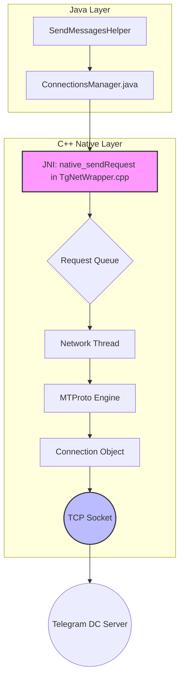
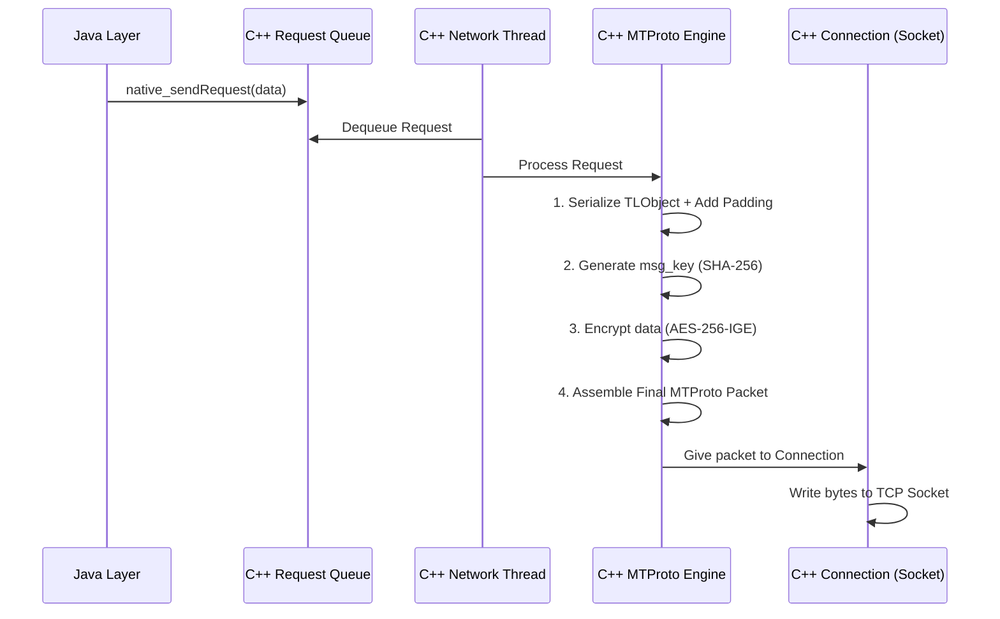

# Deep Dive: Telegram's Native (C++) Message Send Pipeline

#networking #cpp #android #telegram #mtproto

## The Native Core: Architecture Overview

The C++ core is designed for high performance, low-latency, and secure communication. It runs on its own dedicated threads, completely separate from the Android UI thread, to handle all heavy lifting of encryption, decryption, and network I/O.

**Key Components:**

- **`[TgNetWrapper.cpp](code-assist-path:/home/super/workspace/Telegram/TMessagesProj/jni/TgNetWrapper.cpp "/home/super/workspace/Telegram/TMessagesProj/jni/TgNetWrapper.cpp")` (JNI Layer)**: This is the primary bridge between the Java/Kotlin world and the C++ world. It contains the implementations of the `native_*` methods declared in `[ConnectionsManager.java](code-assist-path:/home/super/workspace/Telegram/TMessagesProj/src/main/java/org/telegram/tgnet/ConnectionsManager.java "/home/super/workspace/Telegram/TMessagesProj/src/main/java/org/telegram/tgnet/ConnectionsManager.java")`. Its main job is to translate Java data types (like the `NativeByteBuffer`) into C++ data structures and to dispatch calls to the appropriate C++ objects.
- **`Connection` Class**: This C++ class represents a single, persistent TCP socket connection to a Telegram datacenter (DC). It manages the socket's lifecycle, performs the actual reads and writes, and handles connection-level events like disconnects and timeouts. The application maintains multiple `Connection` objects for different purposes (generic API calls, file uploads, file downloads).
- **MTProto State Machine**: This is the engine that implements Telegram's bespoke cryptographic protocol, MTProto. It's not a single class but a collection of logic responsible for creating, encrypting, and parsing MTProto messages. It manages authorization keys, session IDs, message sequence numbers, and server salts.



---

## Step 1: The JNI Handoff - `native_sendRequest`

The journey into the native layer begins with the `native_sendRequest` call from `[ConnectionsManager.java](code-assist-path:/home/super/workspace/Telegram/TMessagesProj/src/main/java/org/telegram/tgnet/ConnectionsManager.java "/home/super/workspace/Telegram/TMessagesProj/src/main/java/org/telegram/tgnet/ConnectionsManager.java")`.

```java
// ConnectionsManager.java
public static native void native_sendRequest(int currentAccount, long object, int flags, int datacenterId, int connectionType, boolean immediate, int requestToken);
```

1. **Data Reception**: In `[TgNetWrapper.cpp](code-assist-path:/home/super/workspace/Telegram/TMessagesProj/jni/TgNetWrapper.cpp "/home/super/workspace/Telegram/TMessagesProj/jni/TgNetWrapper.cpp")`, the `object` parameter (a `long`) is reinterpreted as a pointer to the `NativeByteBuffer` that was allocated in Java. This gives the C++ code direct, zero-copy access to the serialized `TLObject` (e.g., `TL_messages_sendMessage`).
2. **Request Object Creation**: The raw data is encapsulated in a C++ `Request` object. This object contains the payload, the `requestToken`, and metadata like `flags` and `datacenterId`.
3. **Queuing**: The newly created `Request` object is not sent immediately. It is pushed into a thread-safe queue for the appropriate `Connection` object. This queuing mechanism allows the Java layer to return instantly while the native threads process the request asynchronously.

## Step 2: Packaging for Transport - The MTProto Protocol

Before the request can be written to the socket, it must be securely packaged according to the **MTProto v2.0** protocol. This is the most critical part of the process, ensuring message confidentiality, integrity, and authenticity.

A dedicated network thread dequeues the `Request` and hands it to the MTProto engine. The engine constructs a secure message with the following structure:

#### MTProto v2.0 Packet Structure

```mermaid
graph TD

    %% --- Encrypted Packet Wrapper ---
    subgraph encrypted_packet["Encrypted Packet (Sent over TCP)"]
        A[Auth Key ID (8 bytes)]
        B[Message Key (16 bytes)]
        C[Encrypted Data]
    end

    %% --- Encrypted Data Payload ---
    subgraph encrypted_data["Encrypted Data (Payload for AES-256-IGE)"]
        D[Server Salt (8 bytes)]
        E[Session ID (8 bytes)]
        F[Message ID (8 bytes)]
        G[Sequence Number (4 bytes)]
        H[Message Data Length (4 bytes)]
        I[Message Data (TLObject)]
        J[Padding (0–15 bytes)]
    end

    %% Flow
    A --> B --> C
    C --> encrypted_data

```

**Breakdown of the components:**

- **`auth_key_id`**: An 8-byte identifier for the permanent authorization key used for encryption. This tells the server which key to use for decryption.
- **`msg_key` (Message Key)**: A 16-byte (128-bit) hash that serves as an integrity check. It is calculated as the **middle 128 bits of the SHA-256 hash** of the data that will be encrypted. The server re-calculates this hash after decryption to ensure the message was not tampered with.
- **`encrypted_data`**: This is the core payload, encrypted using **AES-256 in IGE (Infinite Garble Extension) mode**. The encryption key is derived from the `auth_key` and the `msg_key`. IGE mode is chosen for its properties that help detect data manipulation.

**Inside the `encrypted_data`:**

- **`server_salt` & `session_id`**: Values provided by the server to prevent replay attacks and to associate the message with the current session.
- **`message_id`**: A unique, time-dependent identifier for the message. It must be greater than previous message IDs within the session.
- **`seq_no` (Sequence Number)**: A counter that increments for each message within a session. The server uses it to ensure messages are processed in the correct order.
- **`message_data`**: This is the actual serialized `TLObject` (our `TL_messages_sendMessage` request) from Step 1.
- **`padding`**: Random bytes (0 to 15) are added at the end to ensure the total length of the data to be encrypted is a multiple of 16 bytes (the AES block size).

## Step 3: The Send Pipeline - From Queue to Socket

The network thread executes a highly efficient pipeline to process each request.



1. **Dequeue**: The network thread pulls the next pending `Request` from its queue.
2. **Prepare Payload**: The MTProto engine prepares the `encrypted_data` payload: it serializes the `TLObject`, adds the `server_salt`, `session_id`, `message_id`, `seq_no`, and random padding.
3. **Generate `msg_key`**: It computes the SHA-256 hash of this payload and extracts the middle 16 bytes to form the `msg_key`.
4. **Encrypt**: It encrypts the entire payload using AES-256-IGE. The key and IV for this operation are derived from a combination of the master `auth_key` and the `msg_key`.
5. **Assemble Packet**: It prepends the `auth_key_id` and the `msg_key` to the resulting ciphertext.
6. **Socket Write**: The `Connection` object associated with the target datacenter takes this final binary packet and writes it directly to the TCP socket.

## Step 4: Reliability and Acknowledgements

Sending the message is only half the story. MTProto includes mechanisms to guarantee delivery.

- **Pending Queue**: After a message is sent, it is not forgotten. It's placed in a "pending acknowledgement" queue, indexed by its `message_id`.
- **Acknowledgements (`msgs_ack`)**: The server, upon successfully receiving and processing a message, will send back a `msgs_ack` notification containing the `message_id` of the message it received.
- **Confirmation**: When the C++ client receives an `ack`, it removes the corresponding message from the pending queue. This is when the Java layer is ultimately notified of success, and the clock icon turns into a checkmark.
- **Resending**: The network thread periodically scans the pending queue. If an `ack` for a message has not been received within a certain timeout period, the MTProto engine will automatically re-package and resend the message, preventing it from being lost due to transient network issues. This robust resend logic is handled entirely within the C++ layer, abstracting the complexity away from the Java application logic.