# Telegram Request Callback Flow: Native to Java

## Overview

This document explains how Telegram's MTProto request/response system bridges from native C++ code (where network I/O happens) to Java callbacks (where application logic processes results). The key mechanism is the `onCompleteRequestCallback` stored in each `Request` object.

---

  

## Table of Contents

  

1. [[#What is onCompleteRequestCallback|What is `onCompleteRequestCallback`?]]

2. [[#Request Lifecycle|Request Lifecycle]]

3. [[#Complete Flow Diagram|Complete Flow Diagram]]

4. [[#Step-by-Step Flow|Step-by-Step Flow]]

5. [[#Thread Context|Thread Context]]

6. [[#Code References|Code References]]

  

---

  

## What is `onCompleteRequestCallback`?

  

### Type Definition

  

`onCompleteRequestCallback` is a C++ `std::function` callback stored in each `Request` object. It's invoked when a server response arrives (success or error).

  

```cpp

// Defines.h

typedef std::function<void(

TLObject *response, // The deserialized TLObject result

TL_error *error, // Error object if request failed

int32_t networkType, // Network type (WiFi, mobile, etc.)

int64_t responseTime, // Timestamp when response was received

int64_t msgId, // Message ID of the response

int32_t dcId // Datacenter ID that sent the response

)> onCompleteFunc;

```

  

### Storage Location

  

Each `Request` object holds this callback:

  

```cpp

// Request.h

class Request {

// ... other fields ...

onCompleteFunc onCompleteRequestCallback; // ← Stored here

// ... other callbacks ...

};

```

  

### When It's Set

  

The callback is assigned when a request is created:

  

```cpp

// Request.cpp

Request::Request(..., onCompleteFunc completeFunc, ...) {

// ...

onCompleteRequestCallback = completeFunc; // ← Assigned here

// ...

}

```

  

### For Java-Initiated Requests

  

When Java calls `sendRequest()` via JNI, a lambda is created that marshals the response back to Java:

  

```cpp

// TgNetWrapper.cpp

ConnectionsManager::getInstance(instanceNum).sendRequest(request,

([instanceNum, token](TLObject *response, TL_error *error, ...) {

// Convert C++ types to JNI types

jlong ptr = 0;

jint errorCode = 0;

jstring errorText = nullptr;

if (resp != nullptr) {

ptr = (jlong) resp->response.get();

} else if (error != nullptr) {

errorCode = error->code;

errorText = jniEnv[instanceNum]->NewStringUTF(error->text.c_str());

}

// Call Java method via JNI

jniEnv[instanceNum]->CallStaticVoidMethod(

jclass_ConnectionsManager,

jclass_ConnectionsManager_onRequestComplete,

instanceNum, token, ptr, errorCode, errorText, ...

);

}), ...);

```

  

This lambda becomes the `onCompleteRequestCallback` for Java-initiated requests.

  

---

  

## Request Lifecycle

  

### 1. Request Creation (Java → Native)

  


  

### 2. Request Transmission

  


  

### 3. Response Reception

```mermaid

flowchart LR

A[Network: MTProto packet received] --> B[Native: ConnectionSocket::onEvent<br/>→ recv]

B --> C[Native: Connection::onReceivedData<br/>→ AES-CTR decrypt]

C --> D[Native: ConnectionsManager::<br/>onConnectionDataReceived]

D --> E[Native: Datacenter::<br/>decryptServerResponse<br/>→ AES-IGE decrypt]

E --> F[Native: TLdeserialize<br/>→ Creates TLObject]

F --> G[Native: processServerResponse]

```

  



  

### 4. Callback Invocation

  


  

---

  

## Complete Flow Diagram

  

### High-Level Architecture

```mermaid

graph TB

subgraph Native["🔷 Native Network Thread"]

direction TB

A[epoll_wait Loop] --> B[Socket I/O]

B --> C[MTProto Decryption]

C --> D[Response Processing]

D --> E[Request::onComplete]

E --> F[JNI Lambda Callback]

end

subgraph JNI["🔶 JNI Bridge"]

F --> G[CallStaticVoidMethod]

end

subgraph Java["🟢 Java Main Thread"]

G --> H[onRequestComplete]

H --> I[Retrieve Callback]

I --> J[Execute Java Lambda]

end

subgraph StageQueue["🟡 Stage Queue Thread"]

J --> K[Post to stageQueue]

K --> L[User Callback]

end

style Native fill:#4a9eff,color:#fff

style JNI fill:#ffa500,color:#fff

style Java fill:#4caf50,color:#fff

style StageQueue fill:#ffc107,color:#000

```

  



  

### Detailed Flow Sequence

```mermaid

sequenceDiagram

participant Socket as Socket I/O

participant Conn as Connection

participant CM as ConnectionsManager

participant DC as Datacenter

participant Req as Request

participant JNI as JNI Bridge

participant Java as Java Thread

participant Queue as Stage Queue

Note over Socket,Queue: Response Reception & Processing

Socket->>Conn: recv() data

Conn->>Conn: AES-CTR decrypt (transport)

Conn->>CM: onConnectionDataReceived(buffer)

CM->>CM: Read auth_key_id

CM->>DC: decryptServerResponse()

DC->>DC: Generate message key (SHA-256)

DC->>DC: AES-IGE decrypt

DC->>DC: Verify SHA-256 checksum

DC-->>CM: Decrypted data

CM->>CM: TLdeserialize() → TLObject

CM->>CM: processServerResponse(TL_rpc_result)

Note over CM: Find matching Request by req_msg_id

CM->>CM: Handle gzip decompression

CM->>CM: Handle errors (401, 403, 420, etc.)

CM->>Req: request->onComplete(result, error)

Req->>Req: Check onCompleteRequestCallback

Req->>JNI: Invoke lambda callback

Note over JNI,Java: JNI Bridge

JNI->>JNI: Convert C++ types to JNI types

JNI->>Java: CallStaticVoidMethod(onRequestComplete)

Java->>Java: Get RequestCallbacks from map

Java->>Java: Execute stored Java lambda

Note over Java,Queue: Java Callback Processing

Java->>Java: Deserialize response

Java->>Java: Create error object if needed

Java->>Queue: postRunnable() to stageQueue

Queue->>Queue: Execute user callback

Queue->>Queue: OR processUpdates() for Updates

```

  



  

### Component Interaction Flow

  


  

---

  

## Step-by-Step Flow

  

### Phase 1: Request Setup (Java → Native)

  

**1.1. Java initiates request**

```java

// ConnectionsManager.java

sendRequest(object, onComplete, ...)

└─> sendRequestInternal(object, onComplete, ...)

└─> listen(requestToken, (response, errorCode, ...) -> {

// This lambda is stored in requestCallbacks map

// It will be called later when response arrives

})

└─> native_sendRequest(buffer.address, ...)

```

  

**1.2. Native receives request via JNI**

```cpp

// TgNetWrapper.cpp

sendRequest(JNIEnv *env, ..., jlong object, ...) {

TL_api_request *request = new TL_api_request();

request->request = (NativeByteBuffer *) object;

ConnectionsManager::getInstance(instanceNum).sendRequest(request,

([instanceNum, token](TLObject *response, TL_error *error, ...) {

// This lambda becomes onCompleteRequestCallback

// It marshals response to Java via JNI

}),

...);

}

```

  

**1.3. Native creates Request object**

```cpp

// ConnectionsManager.cpp

sendRequestInternal(...) {

Request *request = new Request(

instanceNum, token, type, flags, datacenter,

onComplete, // ← Lambda from step 1.2 becomes onCompleteRequestCallback

onQuickAck,

onWriteToSocket,

onClear

);

runningRequests.push_back(std::unique_ptr<Request>(request));

}

```

  

### Phase 2: Network I/O (Native Thread)

  

**2.1. Socket read**

```cpp

// ConnectionSocket.cpp

onEvent(EPOLLIN) {

readCount = recv(socketFd, buffer->bytes(), READ_BUFFER_SIZE, 0);

onReceivedData(buffer);

}

```

  

**2.2. Transport decryption**

```cpp

// Connection.cpp

onReceivedData(NativeByteBuffer *buffer) {

AES_ctr128_encrypt(buffer->bytes(), ...); // Transport-level decryption

// Parse MTProto packet length

ConnectionsManager::onConnectionDataReceived(this, buffer, length);

}

```

  

**2.3. MTProto decryption**

```cpp

// ConnectionsManager.cpp

onConnectionDataReceived(Connection *connection, NativeByteBuffer *data, ...) {

int64_t keyId = data->readInt64();

if (keyId != 0) {

// Encrypted message

datacenter->decryptServerResponse(keyId, ...); // AES-IGE decrypt

// Read: server_salt, session_id, message_id, seqno, length

TLObject *object = TLdeserialize(nullptr, messageLength, data);

processServerResponse(object, messageId, ...);

}

}

```

  

### Phase 3: Response Processing (Native Thread)

  

**3.1. Process server response**

```cpp

// ConnectionsManager.cpp

processServerResponse(TLObject *message, int64_t messageId, ...) {

if (typeid(*message) == typeid(TL_rpc_result)) {

TL_rpc_result *response = (TL_rpc_result *) message;

int64_t resultMid = response->req_msg_id;

// Find matching request

for (auto iter = runningRequests.begin(); ...) {

Request *request = iter->get();

if (request->respondsToMessageId(resultMid)) {

// Found it!

```

  

**3.2. Handle gzip and errors**

```cpp

if (request->onCompleteRequestCallback != nullptr) {

TLObject *result = response->result.get();

// Decompress if gzipped

if (typeid(*result) == typeid(TL_gzip_packed)) {

unpacked_data = decompressGZip(...);

result = TLdeserialize(request->rawRequest, ...);

}

// Handle various errors (401, 403, 420, 500, etc.)

RpcError *error = dynamic_cast<RpcError *>(result);

if (error != nullptr) {

// Process error codes...

// May set discardResponse = true

}

```

  

**3.3. Invoke callback**

```cpp

if (!discardResponse) {

int32_t dcId = ...;

if (implicitError != nullptr || error2 != nullptr) {

request->onComplete(nullptr, error, ...);

} else {

request->onComplete(response->result.get(), nullptr, ...);

}

}

}

}

}

}

}

```

  

**3.4. Request::onComplete() calls the callback**

```cpp

// Request.cpp

void Request::onComplete(TLObject *result, TL_error *error, ...) {

if (onCompleteRequestCallback != nullptr && (result != nullptr || error != nullptr)) {

completedSent = true;

onCompleteRequestCallback(result, error, ...); // ← Invokes lambda from step 1.2

}

}

```

  

### Phase 4: JNI Bridge (Native → Java)

  

**4.1. Lambda marshals to Java**

```cpp

// TgNetWrapper.cpp - Lambda created in step 1.2

([instanceNum, token](TLObject *response, TL_error *error, ...) {

TL_api_response *resp = (TL_api_response *) response;

jlong ptr = 0;

jint errorCode = 0;

jstring errorText = nullptr;

if (resp != nullptr) {

ptr = (jlong) resp->response.get();

} else if (error != nullptr) {

errorCode = error->code;

errorText = jniEnv[instanceNum]->NewStringUTF(error->text.c_str());

}

// JNI call to Java

jniEnv[instanceNum]->CallStaticVoidMethod(

jclass_ConnectionsManager,

jclass_ConnectionsManager_onRequestComplete,

instanceNum, token, ptr, errorCode, errorText, ...

);

if (errorText != nullptr) {

jniEnv[instanceNum]->DeleteLocalRef(errorText);

}

})

```

  

### Phase 5: Java Callback Execution

  

**5.1. Java receives JNI call**

```java

// ConnectionsManager.java

public static void onRequestComplete(

int currentAccount, int requestToken,

long response, int errorCode, String errorText, ...

) {

ConnectionsManager cm = getInstance(currentAccount);

RequestCallbacks callbacks = cm.requestCallbacks.get(requestToken);

cm.requestCallbacks.remove(requestToken); // Clean up

if (callbacks != null && callbacks.onComplete != null) {

callbacks.onComplete.run(response, errorCode, errorText, ...);

}

}

```

  

**5.2. Java callback deserializes and posts**

```java

// ConnectionsManager.java - Lambda from step 1.1

listen(requestToken, (response, errorCode, errorText, ...) -> {

TLObject resp = null;

TLRPC.TL_error error = null;

if (response != 0) {

NativeByteBuffer buff = NativeByteBuffer.wrap(response);

int magic = buff.readInt32(true);

resp = object.deserializeResponse(buff, magic, true);

} else if (errorText != null) {

error = new TLRPC.TL_error();

error.code = errorCode;

error.text = errorText;

}

final TLObject finalResponse = resp;

final TLRPC.TL_error finalError = error;

// Post to stage queue

Utilities.stageQueue.postRunnable(() -> {

if (onComplete != null) {

onComplete.run(finalResponse, finalError); // User's callback

} else if (finalResponse instanceof TLRPC.Updates) {

MessagesController.processUpdates(...);

}

});

}, ...);

```

  

**5.3. User callback executes**

```java

// User's code

sendRequest(request, (response, error) -> {

// This runs on stageQueue thread

if (error == null) {

// Process response

} else {

// Handle error

}

});

```

  

---

  

## Thread Context

  

### Threads Involved

  


  

1. **Native Network Thread** (`ConnectionsManager::ThreadProc`)

- Runs `epoll_wait()` loop

- Handles all socket I/O

- Processes MTProto decryption

- Calls `processServerResponse()`

- Invokes `onCompleteRequestCallback` (C++ lambda)

  

2. **JNI Thread** (same as Native Network Thread)

- When C++ lambda calls `CallStaticVoidMethod()`, it executes on the native thread

- JNI attaches the thread to Java VM if needed

  

3. **Java Main Thread** (via JNI)

- `onRequestComplete()` static method executes here

- Retrieves callback from `requestCallbacks` map

- Calls Java lambda synchronously

  

4. **Stage Queue Thread** (`Utilities.stageQueue`)

- User's final callback executes here

- Ensures thread-safe access to shared state

- Used for all message processing

  

### Thread Safety

  

- **Native side**: All network operations happen on a single dedicated thread

- **Java side**: Callbacks are posted to `stageQueue` to avoid blocking the main thread

- **JNI**: Thread-safe as long as JNI calls are made from the correct thread context

  

---

  

## Code References

  

### Key Files

  

1. **Native C++**

- `TMessagesProj/jni/tgnet/ConnectionsManager.cpp` - Main request/response handling

- `TMessagesProj/jni/tgnet/Request.cpp` - Request object with callback

- `TMessagesProj/jni/tgnet/Request.h` - Request class definition

- `TMessagesProj/jni/tgnet/Defines.h` - Callback type definitions

- `TMessagesProj/jni/TgNetWrapper.cpp` - JNI bridge with lambda callbacks

  

2. **Java**

- `TMessagesProj/src/main/java/org/telegram/tgnet/ConnectionsManager.java` - Java-side request handling

  

### Key Methods

  

| Method | File | Purpose |

|--------|------|---------|

| `processServerResponse()` | ConnectionsManager.cpp:1085 | Processes incoming TLObject responses |

| `Request::onComplete()` | Request.cpp:55 | Invokes `onCompleteRequestCallback` |

| `onRequestComplete()` | ConnectionsManager.java:499 | Java static method called via JNI |

| `listen()` | ConnectionsManager.java:464 | Stores Java callback in `requestCallbacks` map |

  

### Key Data Structures

  

- **`runningRequests`** (C++): `std::vector<std::unique_ptr<Request>>` - Active requests awaiting responses

- **`requestCallbacks`** (Java): `ConcurrentHashMap<Integer, RequestCallbacks>` - Maps requestToken to Java callbacks

  

---

  

## Summary

  

The request/response flow in Telegram Android uses a multi-stage callback system:

  


  

This design allows:

- **Non-blocking I/O**: Network operations happen on a dedicated thread

- **Type safety**: C++ types are properly converted to Java types via JNI

- **Clean separation**: Native network code is isolated from Java application logic

- **Error handling**: Errors are properly propagated through all layers

  

---

  

## Tags

  

#telegram #android #jni #native #callback #mtproto #network #threading #c++ #java